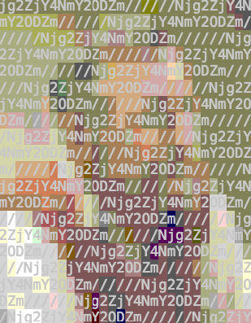

# image-trick

Hide some messages into a image

```
➜  image-trick git:(master) ✗ yarn start -h
yarn run v1.12.0
$ node src/index.js -h
Usage: index [options]

Options:
  -V, --version        output the version number
  -i, --image <image>  set source image, e.g. https://abc.com/d.jpg
  -t, --text <text>    set shown text
  -s, --spliter <s>    set spliter
  -c, --codec <c>      set codec, default: "hex,base64", accept: [hex, base64, jwt] e.g. "hex,jwt"
  -H, --height <h>     set height, e.g. 40 or 50%, and width will be computed to keep aspect ratio
  -h, --help           output usage information
```

Generate a ascii image containing encoded messages:

```
$ yarn start -H 20 --text hohoho --codec hex,base64

Used args:
--------------------
- image: https://upload.wikimedia.org/wikipedia/commons/d/d9/Edsger_Wybe_Dijkstra.jpg
- text: hohoho
- spliter: //////
- codec: hex,base64
--------------------

----------------
code: Njg2ZjY4NmY2ODZm
decoded: hohoho
----------------

fetching and generating...
```


